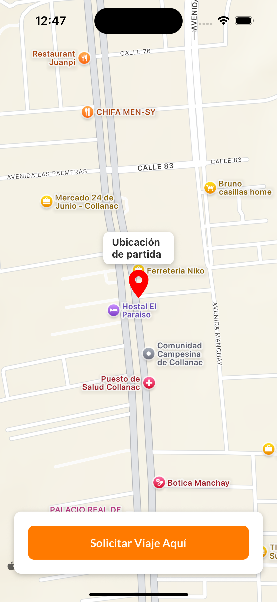
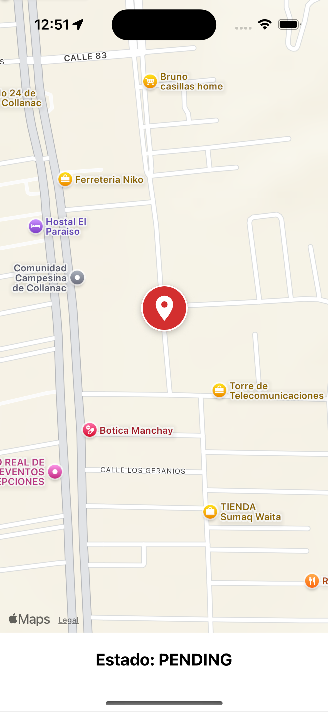
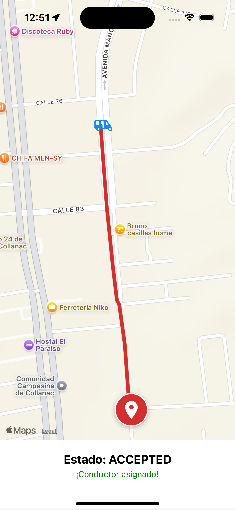
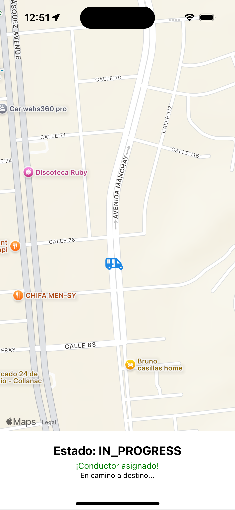
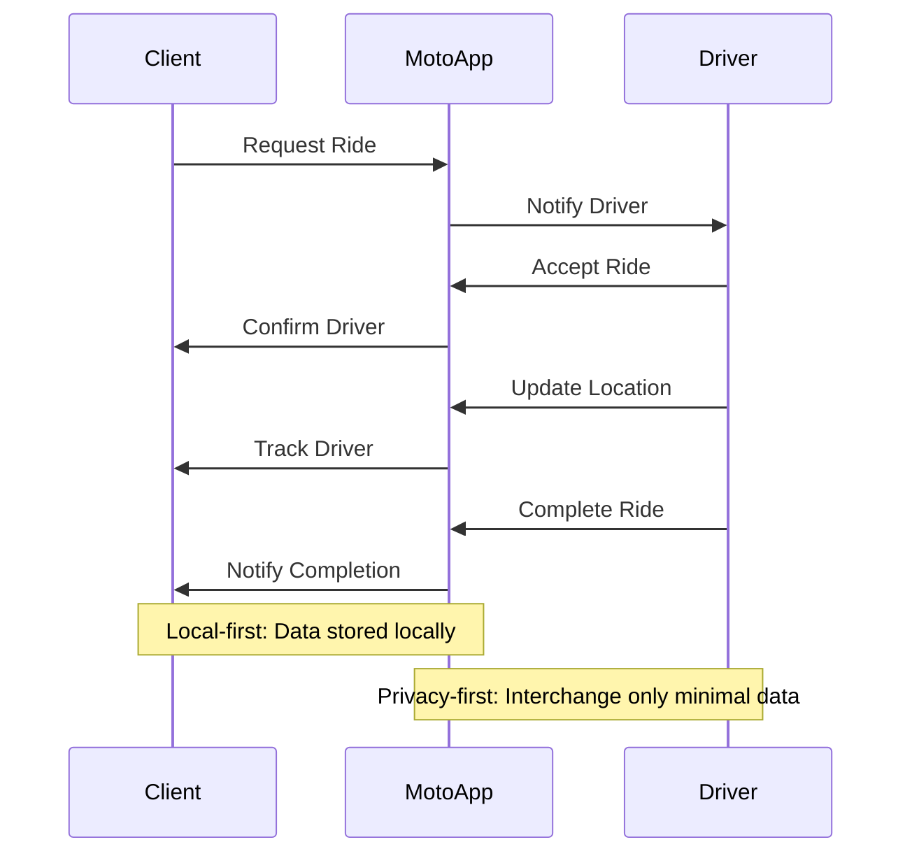

<p align="center">
  
  
  
  
</p>

# Moto — Rickshaw Taxi App

Moto is a local rickshaw (auto) taxi app that connects riders with nearby drivers for short, affordable urban trips. Built with Expo + React Native and powered by EAS, this repository contains the app code, assets, and scripts used to build and publish Moto.

# How Moto works



## What Moto does
- Book rickshaw rides quickly (pickup within minutes)
- Live driver tracking and simple in-app communication
- Transparent fares and ETAs
- Cash and card payments with ride history
- Driver ratings and safety features

## Quick start (this repo)
1. Install dependencies:

```bash
pnpm install
```

2. Run locally (Expo):

```bash
pnpm start
```

3. Build for production with EAS:

```bash
pnpm run build:prod
```

4. Over The Air (OTA) updates with EAS Update:

```bash
eas update --branch production
```

5. Submit to Play Store with EAS Submit:

```bash
eas submit -p android --latest
```

## Minimum Play Console items (first publish)
- Production: start rollout (e.g. 1 (0.0.1))
- Countries/regions: add at least one (e.g. Peru)
- Store listings: language(s) and default listing (e.g. es-419 with app name "Moto")
- App content: content rating questionnaire, target audience (13+), privacy policy URL, ads declaration, data safety questionnaire
- Store settings: app category (Travel & Local)

## 📬 Connect with Binni Cordova

PortFolio
- [binnicordova.com](https://binnicordova.com)

Feel free to reach out if you have any questions or need support. Call [ +1 (650) 374-4225 ](tel:+16503744225) and ask for Binni Cordova.

Contact him:
- [](https://www.linkedin.com/in/binnicordova)
- [](https://calendly.com/binnizenobiocordovaleandro/meet)
- [](https://github.com/binnizenobiocordovaleandro)
- [](mailto:binnizenobiocordovaleandro@gmail.com)
- [](tel:+1-650-374-4225)

